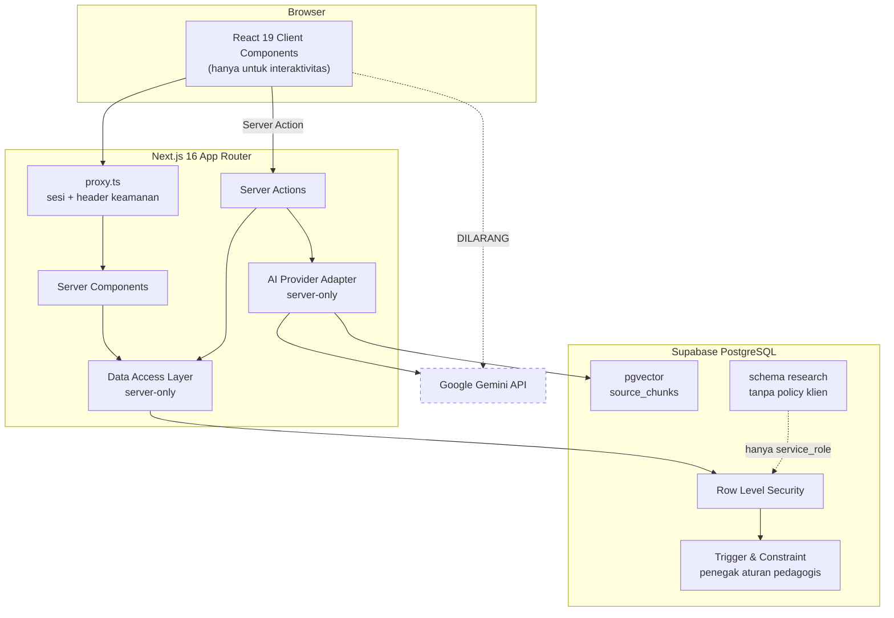

<!-- @format -->

# PT-AI Learning Management System

Learning Management System berbasis _programmed instruction_ yang mengintegrasikan AI untuk
meningkatkan kemampuan berpikir kritis mahasiswa pada mata kuliah Pendidikan Kewarganegaraan.

[](https://nextjs.org)
[](https://react.dev)
[](https://www.typescriptlang.org)
[](https://supabase.com)
[](https://ai.google.dev)
[](#verifikasi)

---

## Masalahnya

Integrasi AI pada pembelajaran biasanya berakhir sebagai mesin penjawab: mahasiswa bertanya,
AI menjawab, dan proses berpikir berpindah tangan.

Sistem ini membalik urutannya. Mahasiswa **menulis lebih dahulu**, AI menanggapi kemudian, dan
setiap saran AI adalah objek yang harus diverifikasi — bukan otoritas yang harus dipercaya.

Yang membedakannya dari sekadar niat baik: aturan itu ditegakkan _constraint_ dan _trigger_
basis data, sehingga tidak dapat dilewati oleh bug aplikasi, klien yang dimodifikasi, maupun
koneksi `service_role`.

Pembelajaran berlangsung dalam enam tahap berurutan yang tidak dapat dilompati:

```
Interpretasi → Analisis → Evaluasi → Inferensi → Eksplanasi → Refleksi
```

Setiap tahap menjalankan siklus **Attempt → Feedback → Verify → Revise → Mastery**.

> Proyek ini adalah artefak penelitian akademik. Rancangannya memprioritaskan keterlacakan
> data dan integritas proses belajar di atas kenyamanan sesaat.

---

## Jaminan yang ditegakkan basis data

Baris berikut bukan konvensi tim, melainkan kendala teknis. Masing-masing punya pengujian yang
membuktikan pelanggarannya ditolak.

| Jaminan                                                         | Penegak                                                                    |
| --------------------------------------------------------------- | -------------------------------------------------------------------------- |
| AI tidak dapat dipanggil sebelum mahasiswa menulis              | `ai_interactions.attempt_id NOT NULL` + trigger `enforce_ai_policy()`      |
| Respons awal tidak dapat ditimpa siapa pun                      | Trigger `prevent_mutation()` pada 15 tabel — menolak `UPDATE` dan `DELETE` |
| AI tidak dapat mengutip di luar sumber yang dilampirkan dosen   | `match_source_chunks()` dibatasi _source pack_ kasus                       |
| AI tidak dapat memberi nilai                                    | Trigger `require_lecturer_scorer()`                                        |
| Keputusan otomatis tidak dapat menyamar sebagai penilaian dosen | Constraint `ck_mastery_results_evaluator`                                  |
| Urutan enam tahap tidak dapat diubah                            | Trigger `protect_stage_order()`                                            |
| Revisi tidak sah tanpa respons awal                             | Trigger `require_baseline_attempt()`                                       |
| Keputusan adaptif tidak dapat disimpan tanpa alasan             | `NOT NULL` + `CHECK length >= 10` pada kolom alasan                        |
| Kutipan AI yang tidak terlacak tetap terlihat                   | `ai_citations.is_traceable` — ditandai, bukan disembunyikan                |
| Administrator tidak dapat membaca nilai dan jawaban mahasiswa   | RLS tanpa policy untuk peran admin                                         |
| Dosen tidak dapat melihat kesediaan ikut penelitian             | RLS `consent_records` hanya untuk pemilik dan admin                        |
| Data penelitian tidak dapat diekspor peran klien                | `revoke execute` pada fungsi ekspor; diuji `has_function_privilege`        |

Dibuktikan **121 skenario pgTAP** yang dijalankan langsung terhadap basis data:

```bash
npm run test:db
```

Dua jaminan lain ditegakkan di lapisan server, bukan basis data, dan disebut terpisah agar
jujur: kuota bantuan AI (20 per jam, 80 per hari per mahasiswa) diperiksa sebelum penyedia
dipanggil, dan seluruh prompt dipseudonimkan sebelum dikirim.

---

## Fitur

### Mahasiswa

- Ruang belajar enam tahap dengan pembaca kasus berkanvas baca khusus
- Editor jawaban dengan _autosave_; respons awal permanen dan tidak dapat ditimpa
- Revisi sebagai versi baru, wajib beralasan, ditampilkan sebagai _diff_ kata per kata
- Refleksi terstruktur sembilan unsur, tersimpan permanen
- Bantuan AI: pertanyaan penuntun, umpan balik rubrik, petunjuk, kontraargumen, klasifikasi
  kesalahan, rekomendasi jalur belajar
- Verifikasi sumber pada enam kriteria dan penautan klaim ke bukti
- Pelaporan saran AI bermasalah dan pernyataan penggunaan AI
- Progres enam dimensi berpikir kritis — dimensi yang belum diukur ditampilkan kosong, bukan
  sebagai skor nol
- Persetujuan keikutsertaan penelitian yang dapat ditarik kapan saja

### Dosen

- Perancang materi: modul, unit, kasus, aktivitas, instruksi
- Kendali AI per aktivitas — mati secara bawaan
- Kurasi sumber berversi sehingga kutipan tetap terlacak saat sumber diperbarui
- Rubrik dengan kriteria terikat pada dimensi berpikir kritis
- Penilaian rubrik, keputusan ketuntasan, keputusan jalur belajar beralasan, dan _override_
- Tinjauan laporan respons AI dari mahasiswa
- Analitik kelas: distribusi ketuntasan, peristiwa tercatat, pengamatan proses, checklist
  keterlaksanaan model
- Instrumen pretest dan posttest, terpisah dari penilaian rubrik

### Administrator

- Struktur akademik: organisasi, fakultas, program studi, periode, mata kuliah, kelas
- Pengelolaan akun dan peran, seluruhnya tercatat pada `audit_logs`
- Aturan retensi data dan ekspor penelitian berpseudonim
- **Tidak memiliki** akses ke jawaban, nilai, maupun refleksi mahasiswa

---

## Arsitektur



Prinsip yang dipegang:

1. **Server Components sebagai bawaan.** Client Component hanya dipakai bila memang membutuhkan
   API browser atau interaktivitas.
2. **Otorisasi di server.** `proxy.ts` menyegarkan sesi, memasang header keamanan, dan melakukan
   pengalihan optimistik — bukan lapisan keamanan utama.
3. **RLS sebagai pertahanan terakhir.** Setiap tabel mengaktifkannya; kegagalan pada lapisan
   aplikasi tidak berujung pada kebocoran data.
4. **AI terisolasi di satu modul `server-only`.** Kunci API tidak pernah menyentuh peramban, dan
   pemanggilan dari klien gagal saat proses build.
5. **Data penelitian terpisah schema.** `research` tidak diekspos PostgREST dan tidak memiliki
   policy untuk peran klien mana pun, termasuk admin.

---

## Teknologi

| Lapisan            | Pilihan                                                                                               |
| ------------------ | ----------------------------------------------------------------------------------------------------- |
| Framework          | Next.js 16.3 (App Router, Turbopack)                                                                  |
| UI                 | React 19.2, Tailwind CSS v4, shadcn/ui (Base UI), Lucide                                              |
| Bahasa             | TypeScript mode `strict` penuh — termasuk `exactOptionalPropertyTypes` dan `noUncheckedIndexedAccess` |
| Basis data         | Supabase PostgreSQL — 60 tabel, 23 enum, 27 fungsi, 52 indeks, 17 migration                           |
| Autentikasi        | Supabase Auth SSR berbasis cookie (`@supabase/ssr`)                                                   |
| Pencarian semantik | pgvector, indeks HNSW, 1536 dimensi                                                                   |
| AI                 | Google Gemini melalui `@google/genai`                                                                 |
| Validasi           | Zod pada setiap batas sistem                                                                          |
| Pengujian          | Vitest 4, React Testing Library, Playwright, axe-core, pgTAP                                          |

---

## Memulai

### Prasyarat

- Node.js 20 atau lebih baru (dikembangkan pada v24.14)
- Proyek [Supabase](https://supabase.com) — _free tier_ mencukupi
- Kunci API [Google AI Studio](https://aistudio.google.com/apikey)

Docker **tidak** diperlukan.

### 1. Instalasi

```bash
git clone https://github.com/Rangga-WebDev/PT-AI.git
cd PT-AI
npm install
```

### 2. Konfigurasi environment

```bash
cp .env.example .env.local
```

| Variabel                        | Sifat       | Keterangan                               |
| ------------------------------- | ----------- | ---------------------------------------- |
| `NEXT_PUBLIC_SUPABASE_URL`      | publik      | URL proyek Supabase                      |
| `NEXT_PUBLIC_SUPABASE_ANON_KEY` | publik      | Dilindungi RLS                           |
| `SUPABASE_SERVICE_ROLE_KEY`     | **rahasia** | Hanya dibaca modul `server-only`         |
| `GEMINI_API_KEY`                | **rahasia** | Hanya dibaca AI provider adapter         |
| `SUPABASE_DB_PASSWORD`          | **rahasia** | Untuk migration dan pengujian basis data |

> [!WARNING]
> Variabel rahasia dilarang memakai prefiks `NEXT_PUBLIC_`. Apa pun yang berprefiks tersebut
> ikut terkirim ke peramban. Jalankan `npm run check:secrets` untuk memastikan tidak ada nilai
> rahasia yang bocor ke _bundle_ klien.

### 3. Siapkan basis data

```bash
npm run db:migrate          # 17 migration
npm run db:seed             # data acuan: peran, kategori kesalahan, aturan retensi
npm run db:seed:users       # akun pengembangan; kata sandi acak ditulis ke .env.local
npm run db:seed:academics   # mata kuliah, kelas, unit, kasus, sumber, klaim
npm run ai:index            # template prompt + embedding potongan sumber
```

> [!NOTE]
> `db:migrate` mencatat berkas yang sudah diterapkan di schema `ops`. Bila basis data Anda
> pernah dimigrasi di luar skrip ini, sebutkan nama berkasnya:
> `npm run db:migrate -- 20260829100017_research_export.sql`

### 4. Verifikasi kesehatan sistem

```bash
npm run ai:check
```

Memeriksa embedding 1536 dimensi, _retrieval_ berbasis sesi mahasiswa, batas akses tanpa sesi,
dan _structured output_.

### 5. Jalankan

```bash
npm run dev
```

Buka <http://localhost:3000>. Akun pengembangan:

| Peran         | Surel                     |
| ------------- | ------------------------- |
| Administrator | `admin.dev@ptai.test`     |
| Dosen         | `dosen.dev@ptai.test`     |
| Mahasiswa     | `mahasiswa.dev@ptai.test` |

Kata sandi dihasilkan acak oleh skrip _seed_ dan tersimpan di `.env.local`.

---

## Perintah

| Perintah                    | Kegunaan                                              |
| --------------------------- | ----------------------------------------------------- |
| `npm run dev`               | Server pengembangan                                   |
| `npm run build`             | Build produksi                                        |
| `npm run start`             | Menjalankan hasil build                               |
| `npm run lint`              | ESLint                                                |
| `npm run typecheck`         | TypeScript tanpa emit                                 |
| `npm run test`              | Unit dan komponen (Vitest)                            |
| `npm run test:db`           | pgTAP terhadap basis data                             |
| `npm run test:e2e`          | Playwright, termasuk audit aksesibilitas              |
| `npm run db:migrate`        | Menerapkan migration                                  |
| `npm run db:seed`           | Data acuan                                            |
| `npm run db:seed:users`     | Akun pengembangan                                     |
| `npm run db:seed:academics` | Konten akademik contoh                                |
| `npm run ai:index`          | Template prompt dan embedding sumber                  |
| `npm run ai:check`          | Uji kesehatan pipeline AI terhadap penyedia sungguhan |
| `npm run data:retention`    | Menerapkan aturan retensi — _dry-run_ tanpa `--apply` |
| `npm run check:secrets`     | Memindai kebocoran rahasia di bundle klien            |
| `npm run check:sql`         | Konsistensi skema, policy, trigger, dan indeks        |
| `npm run check:headers`     | Header keamanan pada server yang sedang berjalan      |

---

## Verifikasi

Angka di bawah berasal dari eksekusi nyata, bukan estimasi.

| Perintah                | Hasil terakhir                         |
| ----------------------- | -------------------------------------- |
| `npm run lint`          | exit 0                                 |
| `npm run typecheck`     | exit 0                                 |
| `npm run test`          | 21 berkas, **165 test** lulus          |
| `npm run test:db`       | **121/121** lulus                      |
| `npm run test:e2e`      | **97/97** lulus                        |
| `npm run build`         | 39 route, exit 0                       |
| `npm run check:headers` | 6 header terpasang                     |
| `npm audit --omit=dev`  | 0 kerentanan                           |
| `npm run check:secrets` | 0 kebocoran (47 bundle klien dipindai) |
| `npm run check:sql`     | 7/7 pemeriksaan bersih                 |

### Rincian pgTAP

| Berkas                         | Skenario | Fokus                                     |
| ------------------------------ | -------- | ----------------------------------------- |
| `rls.test.sql`                 | 18       | RLS aktif pada seluruh tabel              |
| `academic-access.test.sql`     | 8        | Batas akses struktur akademik             |
| `content-access.test.sql`      | 10       | Publikasi konten dan urutan tahap         |
| `attempt-integrity.test.sql`   | 10       | Respons awal append-only                  |
| `source-access.test.sql`       | 11       | Verifikasi sumber dan penautan klaim      |
| `ai-policy.test.sql`           | 12       | Kebijakan AI dan keterlacakan kutipan     |
| `mastery-branching.test.sql`   | 12       | Wewenang penilaian dan alasan percabangan |
| `revision-reflection.test.sql` | 14       | Revisi, alasan, dan refleksi wajib        |
| `analytics-access.test.sql`    | 12       | Batas akses skor dan telemetri            |
| `research-governance.test.sql` | 14       | Consent, schema research, hak eksekusi    |

### Catatan pengujian

**Data yang tidak dapat dibatalkan.** Tabel seperti `attempts`, `revisions`, dan `reflections`
bersifat append-only dan tidak dapat dihapus koneksi mana pun. Pengujian E2E karena itu membuat
unit, kasus, aktivitas, sumber, dan klaim **sekali pakai** pada setiap eksekusi.

**Append-only punya dua lapis.** Dari sesi mahasiswa, `UPDATE` pada tabel append-only tidak
melempar error — RLS membuatnya tidak mengenai baris mana pun. Trigger baru terlihat bekerja
dari koneksi istimewa. Keduanya diuji terpisah; menguji satu lapis saja menyesatkan.

**AI tidak dipanggil saat E2E.** Pengujian berjalan dengan `AI_PROVIDER_MODE=fake` agar
deterministik dan tidak menghabiskan kuota. Integrasi Gemini sungguhan diverifikasi terpisah
oleh `npm run ai:check`.

**E2E berjalan di atas server produksi**, bukan `next dev`. Kompilasi Turbopack pada akses
pertama membuat pengujian mengukur waktu kompilasi alih-alih perilaku aplikasi.

---

## Struktur proyek

```
├── docs/                      Keputusan, arsitektur, keamanan, deployment, progres
├── e2e/                       18 spec Playwright + fixture data sekali pakai
├── scripts/                   Migration, seed, indexing AI, retensi, pemeriksaan keamanan
├── supabase/
│   ├── migrations/            17 migration terurut
│   ├── seed/                  Data acuan
│   └── tests/                 10 berkas pgTAP
└── src/
    ├── actions/               Server Actions per domain
    ├── app/                   Rute App Router + Route Handler ekspor
    ├── components/            UI, layout, kartu, komponen bersama
    ├── features/              Komponen per fitur
    ├── lib/                   Logika murni, validasi, klien Supabase, utilitas
    ├── server/                Repository, adapter AI, telemetri, layanan penelitian
    └── test/                  21 berkas unit dan komponen
```

Logika pedagogis yang dapat diuji tanpa I/O sengaja dipisahkan ke `src/lib/`: `mastery/access.ts`
(pembukaan tahap), `revision/diff.ts` (perbandingan versi), `analytics/aggregate.ts` (ringkasan
dimensi), `research/consent.ts` (keadaan persetujuan), dan `ai/quota.ts` (batas pemakaian).

---

## Keamanan

- **Row Level Security aktif pada seluruh tabel.** Satu tabel tanpa RLS membuat suite gagal.
- **Identitas selalu dari sesi server.** Memakai `getUser()` yang memvalidasi token ke Supabase,
  bukan `getSession()` yang isinya berasal dari cookie.
- **Klien `service_role` terisolasi** pada modul `server-only`, dan pemakaiannya dibungkus
  `withAuditedAdmin()` sehingga meninggalkan jejak audit.
- **Fungsi `security definer` dicabut hak eksekusinya** dari `public`, `anon`, dan
  `authenticated`. PostgreSQL memberikan `EXECUTE` kepada `PUBLIC` secara bawaan — tanpa
  pencabutan ini, batas schema `research` dapat ditembus tanpa melanggar satu policy pun.
- **Header keamanan pada setiap respons**: CSP dengan nonce per permintaan, HSTS,
  `X-Content-Type-Options`, `Referrer-Policy`, `X-Frame-Options`, `Permissions-Policy`.
- **Prompt AI dipseudonimkan.** Tidak memuat nama, NIM, atau surel.
  `ai_interactions.request_digest` menyimpan SHA-256 dari prompt, bukan salinannya.
- **Berkas `.env*` tidak pernah masuk git**, kecuali `.env.example` yang tidak berisi nilai.

Pelonggaran yang disengaja beserta alasannya tercatat di [SECURITY.md](docs/SECURITY.md).

Menemukan celah keamanan? Hubungi pemilik repositori secara privat, jangan membuka _issue_
publik.

---

## Batasan yang diketahui

Disebutkan terbuka agar tidak menjadi kejutan:

- **Jejak belajar tidak dapat dihapus.** Penghapusan data penelitian dilakukan dengan memutus
  pemetaan identitas ke pseudonim, bukan menghapus barisnya. Konsekuensi ini dinyatakan pada
  lembar persetujuan mahasiswa.
- **Aturan retensi tidak berlaku pada tabel append-only** dan ditolak, bukan diterima lalu
  diam-diam tidak berjalan.
- **`style-src-attr 'unsafe-inline'` diizinkan** karena bar progres memakai atribut `style`
  sebaris. Atribut style tidak dapat mengeksekusi skrip; `script-src` tetap ketat.
- **Halaman publik dipaksa `force-dynamic`** agar nonce CSP dapat disisipkan. Halaman statis
  kehilangan nonce dan skrip hidrasinya diblokir peramban.
- **Nol pelanggaran axe bukan jaminan aksesibilitas.** Urutan fokus, kejelasan pesan galat, dan
  kebermaknaan nama _accessible_ tetap menuntut peninjauan manusia.
- **`/design-system` adalah pratinjau internal**, bukan bagian produk.
- **Belum ada fitur unggah berkas**, sehingga tidak ada sanitasi unggahan.

---

## Status pengembangan

Enam belas fase, masing-masing wajib melewati seluruh pemeriksaan sebelum dinyatakan selesai.

| Fase | Nama                                      | Status     |
| ---- | ----------------------------------------- | ---------- |
| 0–2  | Fondasi, design system, application shell | ✅ Selesai |
| 3    | Prototipe visual                          | ✅ Selesai |
| 4    | Arsitektur basis data                     | ✅ Selesai |
| 5    | Autentikasi Supabase SSR                  | ✅ Selesai |
| 6    | Struktur akademik                         | ✅ Selesai |
| 7    | Perancang materi                          | ✅ Selesai |
| 8    | Ruang belajar mahasiswa                   | ✅ Selesai |
| 9    | Verifikasi sumber                         | ✅ Selesai |
| 10   | AI Coach dan RAG                          | ✅ Selesai |
| 11   | Ketuntasan dan branching adaptif          | ✅ Selesai |
| 12   | Revisi dan refleksi                       | ✅ Selesai |
| 13   | Analitik                                  | ✅ Selesai |
| 14   | Penelitian dan tata kelola                | ✅ Selesai |
| 15   | Pengerasan produksi                       | ✅ Selesai |

Rincian setiap fase, termasuk masalah yang ditemukan dan cara mengatasinya, tercatat di
[docs/PROGRESS.md](docs/PROGRESS.md).

---

## Dokumentasi

| Dokumen                                               | Isi                                                  |
| ----------------------------------------------------- | ---------------------------------------------------- |
| [DECISIONS.md](docs/DECISIONS.md)                     | Keputusan LOCKED, OPEN, DEFERRED, dan Change Request |
| [ARCHITECTURE.md](docs/ARCHITECTURE.md)               | Arsitektur target dan struktur folder                |
| [DATABASE.md](docs/DATABASE.md)                       | Prinsip desain, ERD, fungsi, dan trigger             |
| [DATABASE_DICTIONARY.md](docs/DATABASE_DICTIONARY.md) | Kamus data seluruh tabel                             |
| [RLS_MATRIX.md](docs/RLS_MATRIX.md)                   | Matriks hak akses per peran per tabel                |
| [SECURITY.md](docs/SECURITY.md)                       | Kendali keamanan dan pelonggaran yang disengaja      |
| [DEPLOYMENT.md](docs/DEPLOYMENT.md)                   | Urutan rilis, rollback, dan pencabutan kunci         |
| [TESTING.md](docs/TESTING.md)                         | Strategi pengujian dan jebakan yang sudah terbukti   |
| [DESIGN_SYSTEM.md](docs/DESIGN_SYSTEM.md)             | Token desain dan komponen                            |
| [ROUTES.md](docs/ROUTES.md)                           | Peta 39 route                                        |
| [ENVIRONMENT.md](docs/ENVIRONMENT.md)                 | Variabel lingkungan dan lingkungan pengembangan      |
| [CHANGELOG.md](docs/CHANGELOG.md)                     | Perubahan signifikan per fase                        |
| [PROGRESS.md](docs/PROGRESS.md)                       | Log setiap fase beserta masalah yang ditemukan       |

---

## Lisensi

Belum ditetapkan. Seluruh hak dipertahankan oleh penulis sampai lisensi resmi ditambahkan.

Bila Anda memakai atau merujuk karya ini untuk keperluan akademik, mohon cantumkan sitasi
kepada penulis dan tautan repositori.
