<!-- @format -->

# DATABASE — PT-AI Learning Management System

Status dokumen: **USULAN PHASE 4A — menunggu persetujuan.** Belum ada SQL yang ditulis maupun dijalankan.

Dokumen pendamping:

- [DATABASE_DICTIONARY.md](DATABASE_DICTIONARY.md) — kamus data setiap tabel (kolom, tipe, constraint, index).
- [RLS_MATRIX.md](RLS_MATRIX.md) — matriks hak akses per peran per tabel.

## 1. Prinsip Desain

1. **Database adalah penegak aturan pedagogis, bukan sekadar penyimpan data.** Attempt-first, revisi sebagai versi baru, branching beralasan, dan override tercatat ditegakkan oleh constraint dan trigger — bukan hanya oleh kode aplikasi.
2. **RLS adalah pertahanan terakhir** (SEC-003). Setiap tabel yang menyimpan data pengguna mengaktifkan Row Level Security.
3. **Append-only untuk artefak berpikir.** Attempt, revision, feedback, verifikasi, branching decision, override, dan audit tidak dapat di-`UPDATE` atau `DELETE` oleh siapa pun melalui jalur normal.
4. **Admin ≠ otoritas akademik** (SEC-005). Administrator mengelola struktur dan akun, bukan nilai atau jawaban.
5. **Siap multi-institusi** sejak awal melalui `organization_id`, meskipun MVP hanya satu universitas (DEF-002).
6. **Data penelitian terpisah dari data akademik**, diakses melalui pseudonim.
7. **Tidak ada tabel spekulatif.** Setiap tabel di dokumen ini punya alasan keberadaan yang tertulis.

---

## 2. Konvensi

| Aspek         | Aturan                                                                                                                          |
| ------------- | ------------------------------------------------------------------------------------------------------------------------------- |
| Bahasa        | Nama tabel, kolom, enum, dan fungsi dalam **Bahasa Inggris**; label antarmuka diterjemahkan di aplikasi                         |
| Penamaan      | `snake_case`; tabel **jamak**; foreign key `<singular>_id`; index `idx_<table>_<cols>`; constraint `ck_/uq_/fk_<table>_<makna>` |
| Primary key   | `id uuid primary key default gen_random_uuid()`                                                                                 |
| Waktu         | Selalu `timestamptz`; tanggal murni memakai `date`                                                                              |
| Kolom standar | `created_at timestamptz not null default now()`; `updated_at` (dengan trigger) pada tabel yang boleh berubah                    |
| Kepemilikan   | `created_by uuid references profiles(id)` pada seluruh konten akademik                                                          |
| Soft delete   | `deleted_at timestamptz` **hanya** pada konten akademik; artefak mahasiswa tidak pernah dihapus                                 |
| Teks wajib    | `check (length(btrim(col)) > 0)` agar kolom alasan tidak diisi spasi kosong                                                     |
| JSON          | `jsonb`, selalu dengan `default '{}'::jsonb` atau `'[]'::jsonb`                                                                 |
| Urutan        | Kolom `sequence integer not null` + unique bersama induknya                                                                     |

> **Catatan perubahan dari prototipe:** mock PHASE 3 memakai nilai Bahasa Indonesia (`interpretasi`, `evaluasi`). Di database nilai enum memakai Bahasa Inggris (`interpretation`, `evaluation`) sesuai aturan bahasa proyek. Pemetaan label dilakukan di layer aplikasi.

---

## 3. Ekstensi dan Tipe Kustom

**Ekstensi:** `pgcrypto` (UUID), `vector` (pgvector — LOCK-TECH-023), `pg_trgm` (pencarian judul sumber).

| Enum                    | Nilai                                                                                                       | Alasan                                                        |
| ----------------------- | ----------------------------------------------------------------------------------------------------------- | ------------------------------------------------------------- |
| `role_key`              | `student`, `lecturer`, `admin`                                                                              | Tiga peran LOCKED                                             |
| `stage_key`             | `interpretation`, `analysis`, `evaluation`, `inference`, `explanation`, `reflection`                        | Enam tahap LOCK-PED-002; enum mencegah tahap asing disisipkan |
| `ct_dimension`          | `interpretation`, `analysis`, `evaluation`, `inference`, `explanation`, `self_regulation`                   | Enam dimensi LOCK-PED-001                                     |
| `cycle_phase`           | `attempt`, `feedback`, `verify`, `revise`, `mastery`                                                        | Siklus LOCK-PED-003                                           |
| `publication_status`    | `draft`, `published`, `archived`                                                                            | Draft & publish (PHASE 7)                                     |
| `enrollment_status`     | `active`, `dropped`, `completed`                                                                            | —                                                             |
| `mastery_outcome`       | `not_met`, `partially_met`, `met`                                                                           | Ketuntasan berbasis kriteria (LOCK-PED-008)                   |
| `evaluator_kind`        | `system`, `lecturer`                                                                                        | Membedakan penilaian otomatis dan manusia                     |
| `feedback_source`       | `ai`, `lecturer`                                                                                            | Umpan balik AI vs dosen                                       |
| `ai_function`           | `guiding_questions`, `rubric_feedback`, `hint`, `counter_argument`, `error_classification`, `learning_path` | Enam fungsi `AIProvider`                                      |
| `ai_interaction_status` | `success`, `schema_rejected`, `safety_rejected`, `provider_error`                                           | Output gagal validasi wajib tercatat, bukan dibuang           |
| `ai_student_action`     | `pending`, `accepted`, `ignored`, `reported`                                                                | LOCK-PED-011 menuntut jejak saran diterima/ditolak            |
| `source_type`           | `regulation`, `official_document`, `journal_article`, `book`, `news`, `report`, `dataset`, `other`          | Metadata sumber                                               |
| `verification_verdict`  | `credible`, `questionable`, `not_usable`                                                                    | Hasil penilaian sumber                                        |
| `verification_outcome`  | `verified`, `not_verified`, `contradicted`                                                                  | Hasil penelusuran klaim/saran AI ke sumber                    |
| `claim_origin`          | `case`, `student`, `ai`                                                                                     | Klaim bisa berasal dari kasus, mahasiswa, atau AI             |
| `claim_link_type`       | `supports`, `refutes`, `contextualizes`                                                                     | Relasi klaim–bukti                                            |
| `branching_action`      | `remedial`, `enrichment`, `continue`, `hold`                                                                | Keputusan adaptif                                             |
| `override_subject`      | `mastery_result`, `branching_decision`, `assessment_score`, `ai_feedback`                                   | Objek yang boleh di-override dosen                            |
| `incident_status`       | `open`, `reviewing`, `resolved`, `dismissed`                                                                | Penanganan insiden AI                                         |
| `consent_status`        | `granted`, `declined`, `withdrawn`                                                                          | Governance penelitian                                         |
| `assessment_type`       | `formative`, `summative`, `pretest`, `posttest`                                                             | Kebutuhan penelitian (PHASE 14)                               |
| `retention_action`      | `anonymize`, `delete`                                                                                       | Kebijakan retensi                                             |

---

## 4. Peta Domain

60 tabel dalam 10 domain, ditambah 1 schema penelitian terpisah.

| #   | Domain                 | Tabel           | Fase pemakaian |
| --- | ---------------------- | --------------- | -------------- |
| 1   | Identity               | 6               | PHASE 5–6      |
| 2   | Academic               | 5               | PHASE 6        |
| 3   | Content                | 7               | PHASE 7        |
| 4   | Sources                | 8               | PHASE 9–10     |
| 5   | Rubrics                | 3               | PHASE 7        |
| 6   | Student process        | 9               | PHASE 8, 12    |
| 7   | Adaptive learning      | 6               | PHASE 11       |
| 8   | AI                     | 6               | PHASE 10       |
| 9   | Assessment & analytics | 5               | PHASE 12–13    |
| 10  | Governance             | 4               | PHASE 14–15    |
| —   | `research` schema      | 1 tabel + views | PHASE 14       |

---

## 5. ERD per Domain

### 5.1 Identity

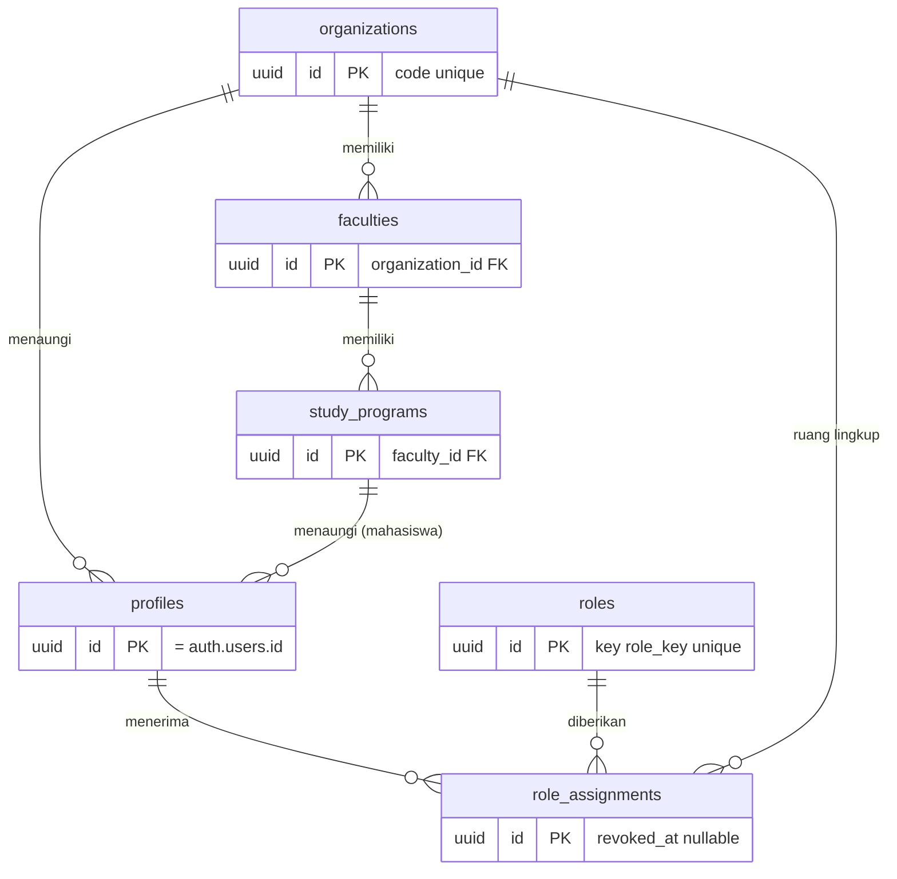

**Catatan kunci**

- `profiles.id` **sama dengan** `auth.users.id` (FK `on delete cascade`). Tidak ada tabel pengguna duplikat.
- Peran disimpan di `role_assignments`, bukan sebagai kolom di `profiles`, agar satu orang bisa berperan ganda (mis. dosen yang juga admin program) dan agar pencabutan peran punya jejak (`revoked_at`).
- Peran **tidak pernah** dibaca dari klien (SEC-004); RLS membacanya melalui fungsi `SECURITY DEFINER`.

### 5.2 Academic

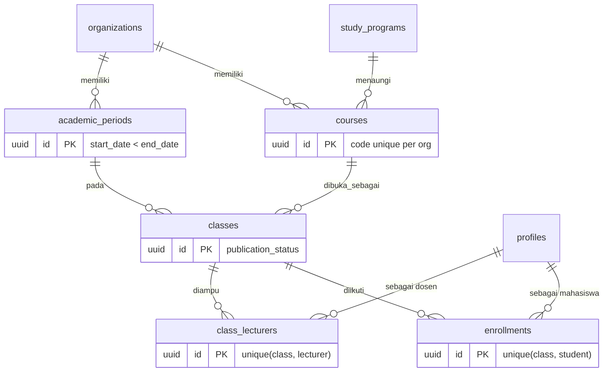

`class_lecturers` dan `enrollments` adalah **sumber kebenaran otorisasi**: seluruh policy RLS untuk konten dan artefak mahasiswa bermuara ke dua tabel ini.

### 5.3 Content

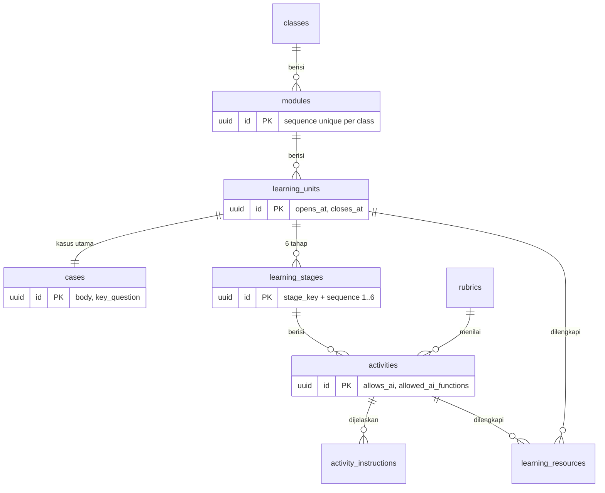

**Catatan kunci**

- `learning_stages` dibuat **enam baris otomatis** saat `learning_units` dibuat, dengan `sequence` terkunci 1–6 sesuai LOCK-PED-002. Dosen boleh menonaktifkan (`is_enabled = false`), tetapi **tidak boleh mengubah urutan atau menambah tahap**.
- `activities.allows_ai` dan `allowed_ai_functions` memberi dosen kendali penuh atas fungsi AI per aktivitas (LOCK-PED-010). Kolom ini diperiksa sebelum setiap panggilan AI.
- `activities.mastery_threshold` menyimpan ambang kriteria kinerja — bukan jumlah klik atau durasi (LOCK-PED-008). Nilai ini **tidak dibaca oleh `computeStageAccess`** dan tidak pernah membuka atau mengunci tahap secara otomatis; ia adalah rujukan yang ditampilkan kepada dosen saat menilai. Ketuntasan tetap ditetapkan manusia (`ck_mastery_results_evaluator`, `require_lecturer_scorer()`). Kolom kosong berarti dosen belum menetapkan rujukan, bukan berarti aktivitas tidak berambang.

### 5.4 Sources

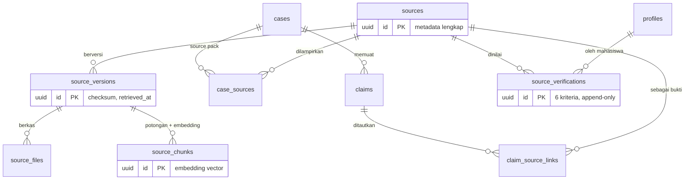

**Catatan kunci**

- Versi sumber dipisahkan agar **kutipan AI tetap dapat ditelusuri** meski sumber diperbarui (LOCK-PED-007). Kutipan menunjuk ke `source_version_id`, bukan hanya `source_id`.
- `source_chunks.embedding` adalah basis RAG. Dimensi vektor bergantung model embedding → lihat Keputusan Terbuka DB-03.
- `source_verifications.checklist` menyimpan enam kriteria (kredibilitas, relevansi, kecukupan, keterlacakan, konsistensi, bias) beserta catatan per kriteria.

### 5.5 Rubrics

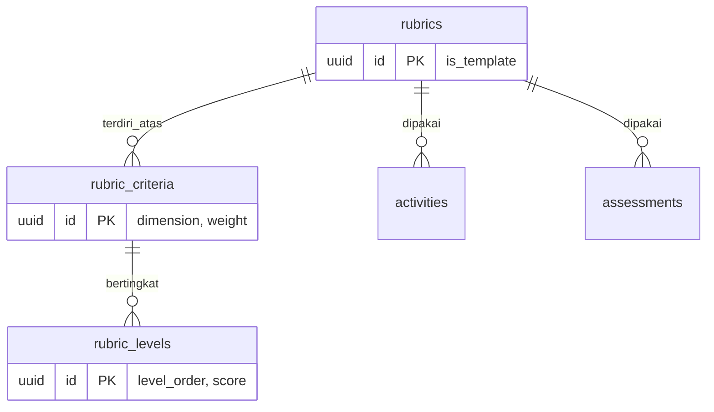

Setiap kriteria terhubung ke salah satu dari enam dimensi berpikir kritis, sehingga skor rubrik dapat diagregasi menjadi profil dimensi tanpa perhitungan tebakan.

### 5.6 Student Process — inti pedagogis

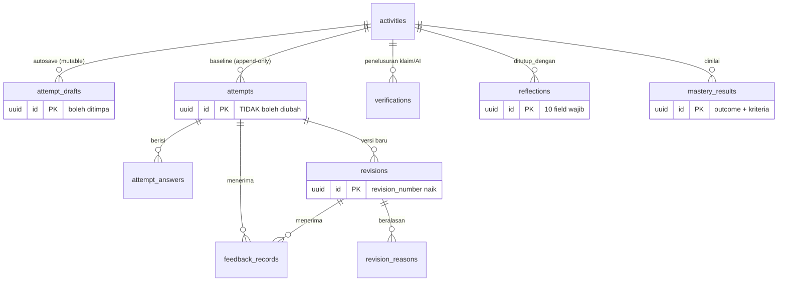

**Pemisahan `attempt_drafts` dan `attempts` adalah keputusan desain terpenting di fase ini.** Autosave memerlukan tulis berulang, sementara LOCK-PED-004 melarang baseline ditimpa. Karena itu:

| Tabel            | Sifat                                               | Fungsi                                      |
| ---------------- | --------------------------------------------------- | ------------------------------------------- |
| `attempt_drafts` | Mutable, satu baris per (activity, student)         | Menampung ketikan berjalan sebelum disimpan |
| `attempts`       | **Append-only**, `is_baseline` pada attempt pertama | Respons awal yang mengunci pembukaan AI     |
| `revisions`      | **Append-only**, bernomor urut                      | Setiap perbaikan adalah record baru         |

Saat mahasiswa menekan "Simpan respons awal", isi draft disalin menjadi `attempts` dan draft dikosongkan. Sejak saat itu baseline tidak dapat diubah oleh mahasiswa, dosen, admin, maupun service role.

**Pembedaan `verifications` dan `source_verifications`** (keduanya diminta requirement §13):

| Tabel                  | Objek yang dinilai  | Pertanyaan yang dijawab                                         |
| ---------------------- | ------------------- | --------------------------------------------------------------- |
| `source_verifications` | Sumber itu sendiri  | "Seberapa kredibel dan layak pakai sumber ini?"                 |
| `verifications`        | Klaim atau saran AI | "Apakah pernyataan ini benar-benar dapat ditelusuri ke sumber?" |

Pembedaan ini menegakkan LOCK-PED-006: AI adalah objek epistemik yang harus diverifikasi, terpisah dari penilaian kualitas sumber.

### 5.7 Adaptive Learning

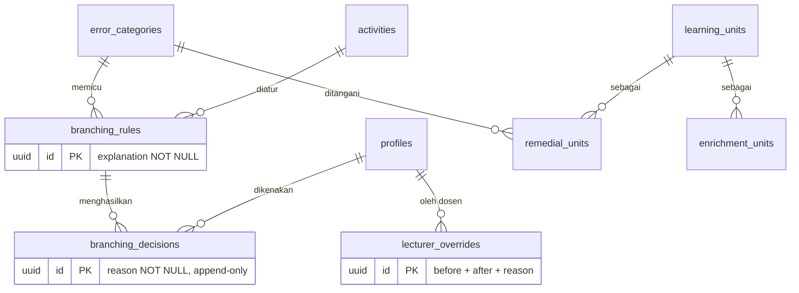

**Anti-black-box ditegakkan constraint**, bukan konvensi: `branching_rules.explanation` dan `branching_decisions.reason` keduanya `NOT NULL` dengan `check (length(btrim(...)) >= 10)`. Aturan atau keputusan tanpa penjelasan **tidak dapat disimpan** (LOCK-PED-009).

`lecturer_overrides` mewajibkan `previous_value`, `new_value`, `reason`, aktor, dan waktu — seluruhnya `NOT NULL` (aturan database §13 no. 11).

### 5.8 AI

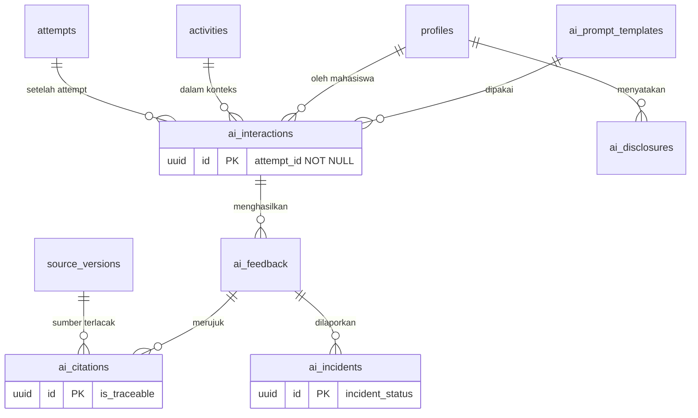

**`ai_interactions.attempt_id` bersifat `NOT NULL`.** Ini menjadikan attempt-first (LOCK-PED-004) sebagai kendala database: interaksi AI tidak dapat dicatat tanpa attempt yang sudah tersimpan.

`ai_citations.is_traceable` memaksa sistem menyatakan secara eksplisit apakah kutipan benar-benar tertaut ke `source_version` — mencegah AI mengklaim verifikasi yang tidak dilakukan (LOCK-PED-005).

### 5.9 Assessment & Analytics

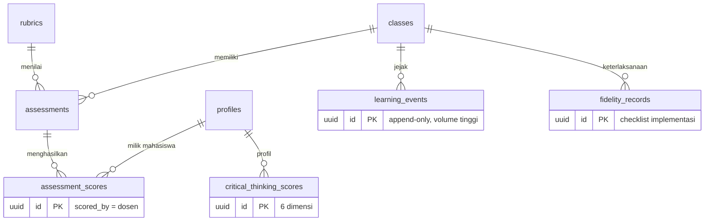

`assessment_scores.scored_by` hanya boleh diisi profil berperan `lecturer` — dijamin oleh check constraint berbasis fungsi. **AI tidak pernah menjadi penilai akhir** (LOCK-PED-005).

`critical_thinking_scores` sengaja menyimpan `measured_at` dan `source`, agar skor dipahami sebagai pengukuran pada satu titik waktu — bukan label permanen tentang mahasiswa (aturan §13 no. 14).

### 5.10 Governance

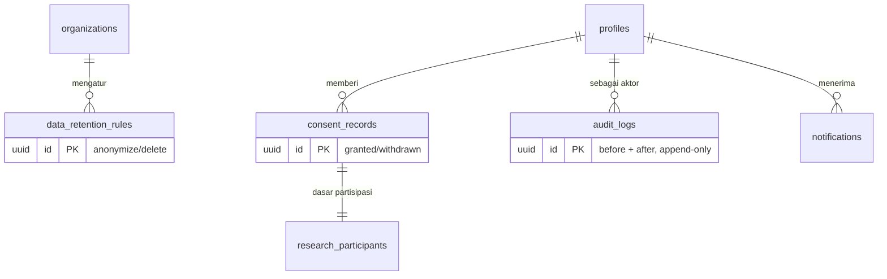

---

## 6. Pemisahan Data Akademik dan Penelitian

Schema `research` terpisah dari `public` (aturan §13 no. 16).

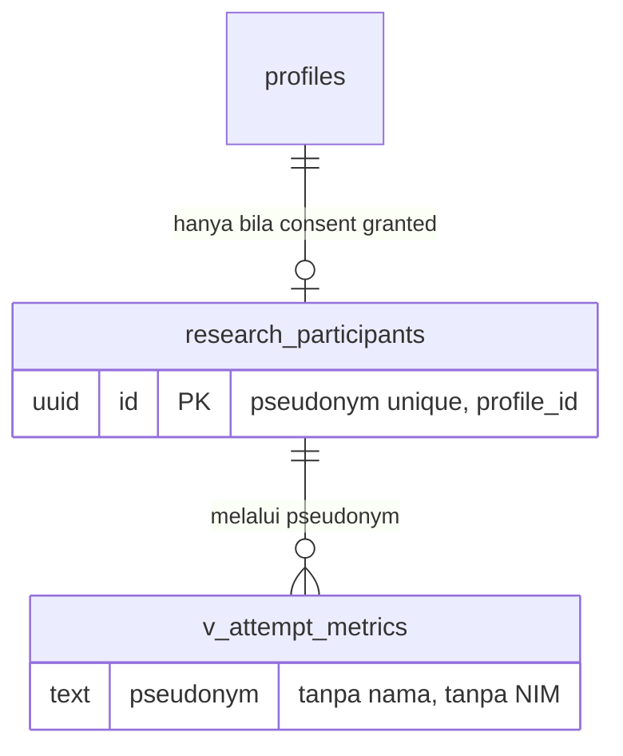

- `research.participants` adalah **satu-satunya** tempat pemetaan `profile_id ↔ pseudonym`; aksesnya dibatasi ke peran khusus, bukan admin biasa.
- View export (`research.v_*`) hanya memakai `pseudonym`, tanpa `full_name`, `identifier`, atau `email`.
- Mahasiswa yang mencabut consent otomatis keluar dari view karena view memfilter `consent_status = 'granted'`.

---

## 7. Fungsi Pendukung RLS

Semua ditulis `security definer`, `stable`, dengan `set search_path = public, pg_catalog` agar tidak bisa dibajak lewat manipulasi `search_path`.

| Fungsi                       | Kegunaan                                                                        |
| ---------------------------- | ------------------------------------------------------------------------------- |
| `current_profile_id()`       | Mengambil `auth.uid()` dan memastikan profilnya aktif                           |
| `current_organization_id()`  | Ruang lingkup multi-institusi                                                   |
| `has_role(role_key)`         | Cek peran aktif (belum dicabut)                                                 |
| `is_admin()`                 | Pintasan peran administrator                                                    |
| `is_lecturer_of_class(uuid)` | Dosen yang **ditugaskan** ke kelas tersebut                                     |
| `is_enrolled_in_class(uuid)` | Mahasiswa aktif di kelas tersebut                                               |
| `class_of_activity(uuid)`    | Menelusuri activity → stage → unit → module → class                             |
| `can_read_activity(uuid)`    | Gabungan: dosen pengampu atau mahasiswa terdaftar, dan konten sudah `published` |

**Alasan `security definer`:** tanpa itu, policy pada `enrollments` akan memicu evaluasi rekursif ketika dipakai di policy tabel lain.

Trigger pendukung:

| Trigger                     | Fungsi                                                            |
| --------------------------- | ----------------------------------------------------------------- |
| `set_updated_at()`          | Menyegarkan `updated_at` pada tabel mutable                       |
| `prevent_mutation()`        | `RAISE EXCEPTION` pada `UPDATE`/`DELETE` untuk tabel append-only  |
| `seed_learning_stages()`    | Membuat enam tahap otomatis saat `learning_units` dibuat          |
| `enforce_single_baseline()` | Menjamin hanya satu attempt `is_baseline` per (activity, student) |
| `write_audit_log()`         | Mencatat operasi sensitif ke `audit_logs`                         |

Daftar tabel append-only: `attempts`, `attempt_answers`, `revisions`, `revision_reasons`, `feedback_records`, `verifications`, `source_verifications`, `reflections`, `branching_decisions`, `lecturer_overrides`, `ai_interactions`, `ai_citations`, `ai_disclosures`, `learning_events`, `audit_logs`.

> Catatan jujur: `service_role` Supabase memiliki atribut `BYPASSRLS`, sehingga RLS saja tidak cukup untuk melindungi baseline. Trigger `prevent_mutation()` **tidak** di-bypass oleh service role, sehingga baseline tetap terlindungi bahkan dari kode server yang keliru. Ini alasan trigger dipakai, bukan sekadar policy.

---

## 8. Rencana Index

Index dibuat berdasarkan query nyata yang sudah terlihat dari PHASE 3 (aturan §13 no. 7), bukan spekulasi.

| Query nyata             | Index                                                                |
| ----------------------- | -------------------------------------------------------------------- |
| Daftar kelas mahasiswa  | `enrollments(student_id, status)`                                    |
| Daftar kelas dosen      | `class_lecturers(lecturer_id)`                                       |
| Isi kelas berurutan     | `modules(class_id, sequence)`, `learning_units(module_id, sequence)` |
| Tahap suatu unit        | `learning_stages(learning_unit_id, sequence)`                        |
| Attempt milik mahasiswa | `attempts(activity_id, student_id)`, partial unique `is_baseline`    |
| Riwayat revisi          | `revisions(attempt_id, revision_number)`                             |
| Antrean review dosen    | `mastery_results(activity_id, outcome)`                              |
| Audit AI per mahasiswa  | `ai_interactions(student_id, created_at desc)`                       |
| Retrieval RAG           | `source_chunks` HNSW pada `embedding` (`vector_cosine_ops`)          |
| Pencarian judul sumber  | `sources` GIN `pg_trgm` pada `title`                                 |
| Analitik peristiwa      | `learning_events(class_id, occurred_at desc)`                        |

---

## 9. Rencana Migration

Satu file per domain agar mudah ditinjau dan di-rollback.

| Urutan | File                         | Isi                                              |
| ------ | ---------------------------- | ------------------------------------------------ |
| 0001   | `extensions_and_types.sql`   | Ekstensi + seluruh enum                          |
| 0002   | `identity.sql`               | Domain 1                                         |
| 0003   | `academic.sql`               | Domain 2                                         |
| 0004   | `content.sql`                | Domain 3                                         |
| 0005   | `rubrics.sql`                | Domain 5 (didahulukan karena dirujuk activities) |
| 0006   | `sources.sql`                | Domain 4 + pgvector                              |
| 0007   | `student_process.sql`        | Domain 6                                         |
| 0008   | `adaptive.sql`               | Domain 7                                         |
| 0009   | `ai.sql`                     | Domain 8                                         |
| 0010   | `assessment.sql`             | Domain 9                                         |
| 0011   | `governance.sql`             | Domain 10                                        |
| 0012   | `research_schema.sql`        | Schema penelitian + views                        |
| 0013   | `functions_and_triggers.sql` | Helper RLS, trigger append-only, audit           |
| 0014   | `rls_policies.sql`           | `enable row level security` + seluruh policy     |
| 0015   | `indexes.sql`                | Index dari bagian 8                              |

**Urutan dependensi:** `rubrics` sebelum `content` karena `activities.rubric_id` merujuknya; `sources` sebelum `student_process` karena verifikasi merujuk sumber; policies paling akhir agar seluruh tabel dan fungsi telah ada.

**Strategi rollback**

1. Setiap file punya pasangan `down` di `supabase/migrations/rollback/` (urutan terbalik).
2. Sebelum `db push` pertama ke Cloud, dijalankan `supabase db diff` untuk meninjau SQL yang akan dieksekusi.
3. Rollback produksi tidak menghapus tabel berisi artefak mahasiswa; yang dilakukan adalah migrasi maju (forward-fix), sesuai praktik yang akan didokumentasikan pada PHASE 15.
4. Perubahan schema **tidak pernah** dilakukan lewat dashboard Supabase — hanya melalui file migration (LOCK-TECH-020).

---

## 10. Pemetaan Requirement → Mekanisme

| Requirement LOCKED                       | Ditegakkan oleh                                                                                |
| ---------------------------------------- | ---------------------------------------------------------------------------------------------- |
| LOCK-PED-002 urutan enam tahap           | Enum `stage_key` + `sequence` 1–6 + trigger `seed_learning_stages()` + larangan ubah urutan    |
| LOCK-PED-004 attempt tidak ditimpa       | Pemisahan `attempt_drafts`/`attempts` + trigger `prevent_mutation()` + partial unique baseline |
| LOCK-PED-004 AI terkunci sebelum attempt | `ai_interactions.attempt_id NOT NULL`                                                          |
| LOCK-PED-004 revisi versi baru           | `revisions.revision_number` + append-only                                                      |
| LOCK-PED-005 AI bukan penilai            | `assessment_scores.scored_by` wajib dosen; tidak ada jalur AI menulis nilai                    |
| LOCK-PED-007 kutipan terlacak            | `ai_citations` → `source_versions` + kolom `is_traceable`                                      |
| LOCK-PED-008 mastery berbasis kriteria   | `mastery_results.criteria_scores` + `activities.mastery_threshold`                             |
| LOCK-PED-009 branching transparan        | `explanation`/`reason` NOT NULL + append-only                                                  |
| LOCK-PED-010 kewenangan dosen            | `lecturer_overrides` + policy tulis nilai hanya untuk dosen pengampu                           |
| LOCK-PED-011 refleksi lengkap            | Sepuluh kolom wajib pada `reflections`                                                         |
| LOCK-PED-012 jejak lengkap               | 15 tabel append-only + `audit_logs`                                                            |
| §13 no. 12 multi-institusi               | `organization_id` pada domain yang relevan                                                     |
| §13 no. 16 pemisahan penelitian          | Schema `research` + pseudonim                                                                  |
| SEC-005 admin ≠ akademik                 | Matriks RLS menolak admin pada nilai dan jawaban                                               |

---

## 11. Keputusan Terbuka (perlu jawaban Anda sebelum PHASE 4B)

| ID        | Pertanyaan                                                                                  | Usulan saya                                                                                                                                                                                                                 |
| --------- | ------------------------------------------------------------------------------------------- | --------------------------------------------------------------------------------------------------------------------------------------------------------------------------------------------------------------------------- |
| **DB-01** | Tabel mana yang memakai soft delete?                                                        | Konten akademik (`courses`, `classes`, `modules`, `learning_units`, `cases`, `activities`, `sources`, `rubrics`) memakai `deleted_at`; artefak mahasiswa **tidak pernah** dihapus, hanya diarsipkan lewat kebijakan retensi |
| **DB-02** | Nilai enum Bahasa Inggris, berbeda dari mock Indonesia?                                     | Ya — konsisten dengan aturan bahasa proyek; label Indonesia dipetakan di aplikasi                                                                                                                                           |
| **DB-03** | Dimensi vektor `source_chunks.embedding`?                                                   | Tunggu keputusan model embedding (OPEN-004). Usulan: mulai `vector(1536)`; bila model lain dipilih, ganti lewat migration baru                                                                                              |
| **DB-04** | Cakupan `audit_logs`                                                                        | Hanya operasi sensitif (perubahan peran, override, penilaian, akses data penelitian, operasi service role) — bukan setiap `SELECT`, agar tabel tidak meledak                                                                |
| **DB-05** | Retensi `learning_events` (volume tinggi)                                                   | Simpan detail 12 bulan, lalu agregasi; partisi bulanan ditunda sampai volume nyata terlihat (PHASE 13)                                                                                                                      |
| **DB-06** | Apakah pembedaan `verifications` vs `source_verifications` (bagian 5.6) sesuai maksud Anda? | Ya seperti dijelaskan; bila tidak, saya sesuaikan sebelum SQL ditulis                                                                                                                                                       |
| **DB-07** | Satu `case` per `learning_unit`, atau boleh banyak?                                         | Satu kasus utama per unit (relasi 1:1) agar alur enam tahap tetap fokus; kasus tambahan dapat dilampirkan sebagai `learning_resources`                                                                                      |

---

## 12. Yang Belum Dikerjakan pada 4A

Sesuai batasan fase: **tidak ada file SQL, tidak ada koneksi database, tidak ada dependency baru.** Implementasi menunggu persetujuan dokumen ini.
